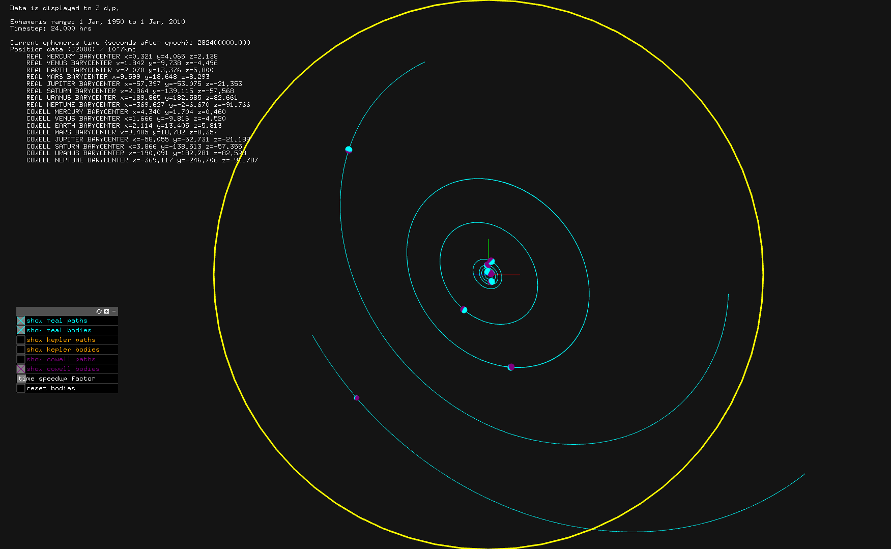

# planetaryOrbit

An orbit simulator for the solar system.

Three methods are used:
- loading the real path
- calculating the ideal Keplerian orbital ellipse
- using Cowell's method and Euler integration

Real data is loaded using the NASA SPICE API for C ([documentation](https://naif.jpl.nasa.gov/pub/naif/toolkit_docs/C/cspice/))

## Functionality

The 3D scene view can be manipulated (on startup, a help panel is shown that gives the controls) .

Gridlines and fullscreen mode can be toggled.

Using the GUI panel, it is possible to toggle the paths and bodies of each simulation type, and to reset the simulation. The GUI is movable by dragging the top bar, and the settings can be saved/loaded.

The "time speedup factor" on the GUI can be used to control how many times faster the simulation runs compared to real time.

The simulation is of the solar system, but if needed, other SPICE kernels can be downloaded to simulate other systems or bodies.

## Installation

- Download and install [OpenFrameworks](https://openframeworks.cc/)
- Download and install [CSPICE](https://naif.jpl.nasa.gov/naif/toolkit_C.html)
- Create a new OpenFrameworks project
- Download the [src](src/) folder and move the contents to your project src/ folder
- Compile and run with your preferred method (see OpenFrameworks help page) - be sure to include the CSPICE library

The files uploaded to this Github page were created on Linux-x64 and compiled with gcc. Thus the executable in bin/ might be runnable on a different computer with the same OS, but it would be best to compile it yourself. See the [screenshots](screenshots/) folder for screenshots of the program running.
